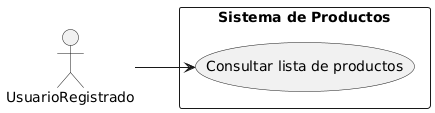
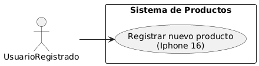
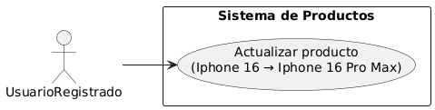
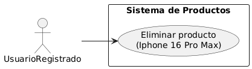
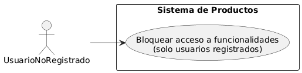
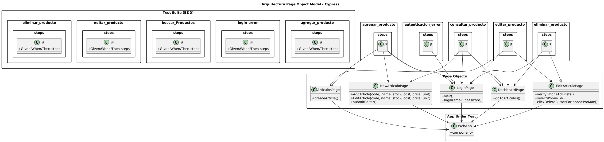

# Test Automation Engineer - Frontend Testing Project

## 📋 Descripción del Proyecto

Este proyecto forma parte de la formación **Test Automation Engineer** y tiene como objetivo validar los conocimientos adquiridos mediante la implementación de pruebas end-to-end (E2E) para una aplicación web.

El proyecto implementa pruebas automatizadas utilizando **Cypress** con enfoque en **BDD (Behavior Driven Development)** y **POM (Page Object Model)** para garantizar un código mantenible y escalable.

## 🎯 Objetivos del Proyecto

Implementar pruebas E2E para las siguientes historias de usuario:

- ✅ **Como usuario registrado**, quiero poder acceder al sistema y realizar la consulta de productos



- ✅ **Como usuario registrado**, quiero poder registrar un nuevo producto (iPhone 16)



- ✅ **Como usuario registrado**, quiero poder actualizar un producto (iPhone 16 → iPhone 16 Pro Max)



- ✅ **Como usuario registrado**, quiero poder eliminar un producto (iPhone 16 Pro Max)



- ✅ **Como usuario no registrado**, quiero validar que no puedo acceder al sistema



## 🏗️ Arquitectura del Proyecto

### Patrón de Diseño Implementado

El proyecto utiliza una combinación de **BDD + POM (Page Object Model)** como se muestra en el diagrama:



Esta arquitectura proporciona:
- **Separación de responsabilidades**: Lógica de pruebas separada de la interacción con elementos
- **Reutilización de código**: Métodos comunes centralizados en Page Objects
- **Mantenibilidad**: Cambios en la UI requieren actualizaciones mínimas
- **Legibilidad**: Pruebas escritas en lenguaje natural con Gherkin

## 🛠️ Tecnologías Utilizadas

- **Cypress**: Framework de testing E2E
- **JavaScript/TypeScript**: Lenguaje de programación
- **Gherkin**: Para escribir escenarios BDD
- **Page Object Model**: Patrón de diseño para organización del código
- **Node.js**: Entorno de ejecución

## 📁 Estructura del Proyecto

```
Test-FrontEnd-Globant/
├── cypress/
│   ├── e2e/
│   │   ├── features/           # Archivos .feature con escenarios Gherkin
│   │   └── step_definitions/   # Implementación de los steps
│   ├── fixtures/               # Datos de prueba
│   ├── pages/                  # Page Objects
│   └── support/               # Comandos personalizados y configuración
├── images/
│   └── BDD-POM.png            # Diagrama de arquitectura
├── cypress.config.js          # Configuración de Cypress
├── package.json
└── README.md
```

## 🚀 Instalación y Configuración

### Prerrequisitos

- Node.js (versión 14 o superior)
- npm o yarn

### Pasos de Instalación

1. **Clonar el repositorio**
   ```bash
   git clone https://github.com/GuillermoEchague/Test-FrontEnd-Globant.git
   cd Test-FrontEnd-Globant
   ```

2. **Instalar dependencias**
   ```bash
   npm install
   ```

3. **Configurar variables de entorno** (si es necesario)
   ```bash
   # Crear archivo .env con las configuraciones necesarias
   ```

## ▶️ Ejecución de Pruebas

### Modo Interactivo (Cypress Test Runner)
```bash
npx cypress open
```

### Modo Headless (Línea de comandos)
```bash
npx cypress run
```

### Ejecutar pruebas específicas
```bash
# Ejecutar un archivo específico
npx cypress run --spec "cypress/e2e/features/productos.feature"

# Ejecutar con un navegador específico
npx cypress run --browser chrome
```

## 🎯 Aplicación Bajo Prueba

- **URL de la aplicación**: https://test-adl.leonardojose.dev
- **Credenciales de prueba**: Configuradas en los fixtures o variables de entorno

## 📊 Escenarios de Prueba

### 1. Gestión de Productos
- **Consulta de productos**: Verificar listado de productos para usuarios autenticados
- **Creación de productos**: Registrar nuevo producto "iPhone 16"
- **Actualización de productos**: Modificar "iPhone 16" a "iPhone 16 Pro Max"
- **Eliminación de productos**: Remover producto creado

### 2. Control de Acceso
- **Validación de autenticación**: Verificar que usuarios no registrados no pueden acceder

## 📈 Reportes y Cobertura

Los reportes de ejecución se generan automáticamente e incluyen:
- Resultados de las pruebas ejecutadas
- Capturas de pantalla en caso de fallos
- Videos de la ejecución (modo headless)
- Cobertura de requisitos
- Análisis de riesgos

## 🔧 Page Objects Implementados

```javascript
// Ejemplo de estructura de Page Object
class ProductPage {
  // Selectores
  elements = {
    productList: '[data-cy="product-list"]',
    addButton: '[data-cy="add-product"]',
    nameInput: '[data-cy="product-name"]'
  }
  
  // Métodos
  navigateToProducts() { ... }
  createProduct(productData) { ... }
  updateProduct(oldName, newData) { ... }
  deleteProduct(productName) { ... }
}
```

## 📝 Ejemplo de Escenario BDD

```gherkin
Feature: Gestión de Productos
  Como usuario registrado
  Quiero gestionar productos en el sistema
  Para mantener actualizado el inventario

  Scenario: Crear un nuevo producto
    Given que soy un usuario registrado
    And he iniciado sesión en el sistema
    When navego a la sección de productos
    And creo un nuevo producto con nombre "iPhone 16"
    Then el producto debe aparecer en la lista
    And debe mostrar la información correcta
```

## 🤝 Contribución

1. Fork del proyecto
2. Crear una rama para la nueva funcionalidad (`git checkout -b feature/nueva-funcionalidad`)
3. Commit de los cambios (`git commit -am 'Agregar nueva funcionalidad'`)
4. Push a la rama (`git push origin feature/nueva-funcionalidad`)
5. Crear un Pull Request

## 📞 Contacto

**Desarrollado por**: Guillermo Echague
**Proyecto**: Formación Test Automation Engineer
**Institución**: Desafío Latam

---

## 📚 Documentación Adicional

- [Cypress Documentation](https://docs.cypress.io/)
- [BDD Best Practices](https://cucumber.io/docs/bdd/)
- [Page Object Model Pattern](https://martinfowler.com/bliki/PageObject.html)

## ⚖️ Licencia

Este proyecto está bajo la licencia MIT. Ver el archivo `LICENSE` para más detalles.